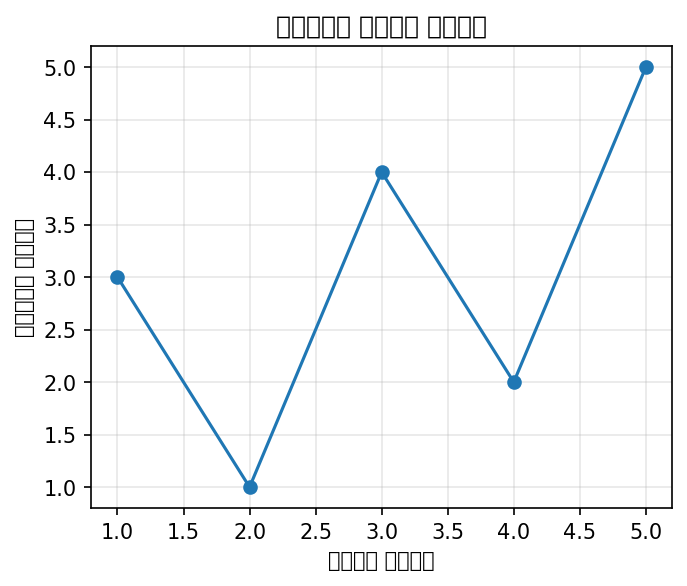
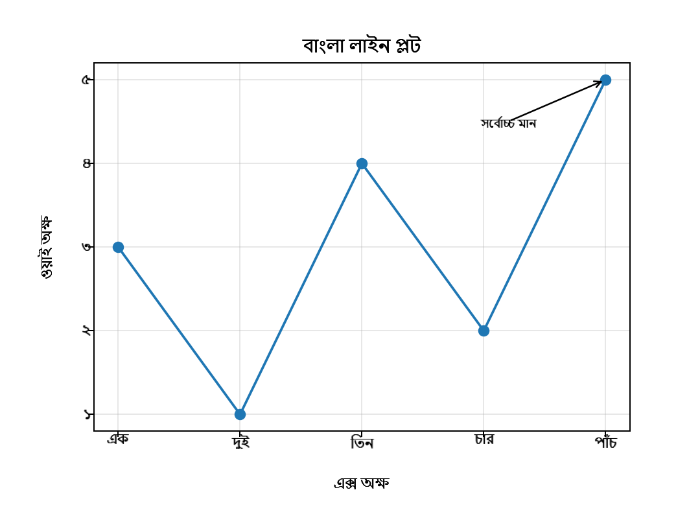
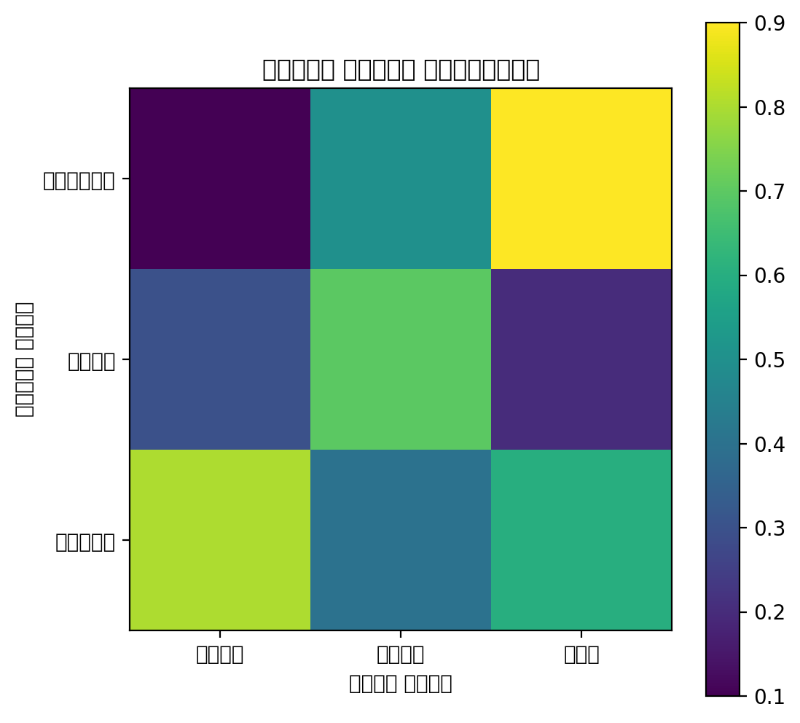
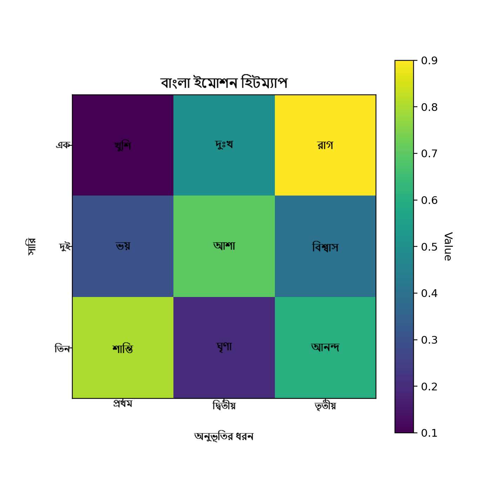
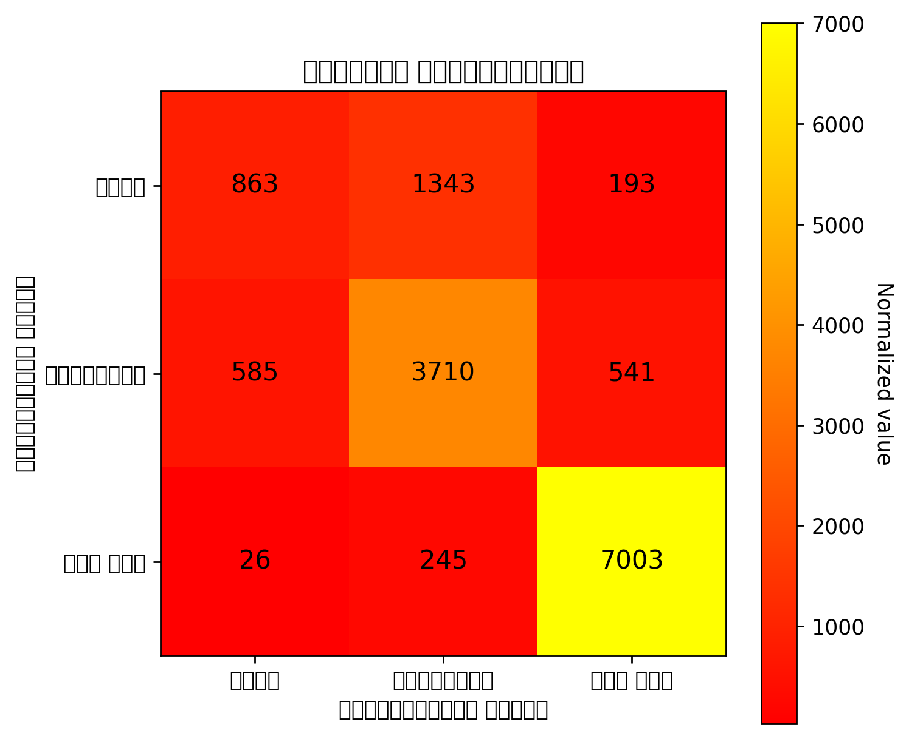
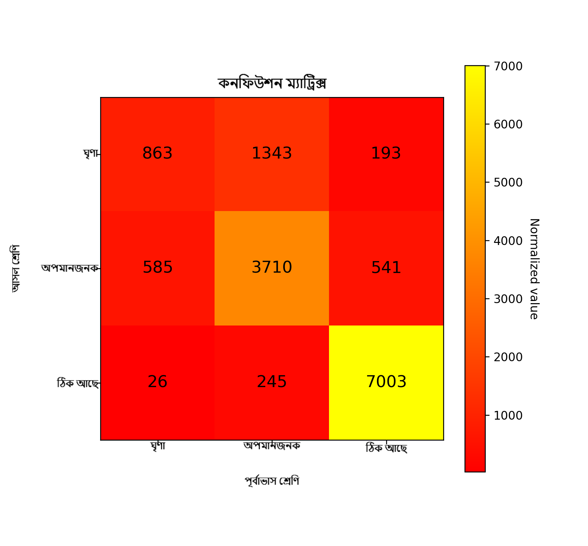

# 🇧🇩 bangla-render
<p align="center">
  
</p>

<p align="center">

  <!-- PyPI version -->
  <a href="https://pypi.org/project/bangla-render/">
    
  </a>

  <!-- Python versions (explicit >=3.8 badge) -->
  <a href="https://pypi.org/project/bangla-render/">
    
  </a>

  <!-- License -->
  <a href="https://github.com/mbs57/bangla-render/blob/main/LICENSE">
    
  </a>

  <!-- Author -->
  <a href="https://github.com/mbs57">
    
  </a>

</p>


### Bengali Text Rendering for Matplotlib & Seaborn (with full OpenType shaping)

**bangla-render** is the first open-source Python library that enables fully correct **Bengali text rendering** inside Matplotlib and Seaborn.

Matplotlib cannot shape Bengali text — it does not use HarfBuzz and therefore fails with:

* Matra (ি, ী, ু, ূ, ৃ)
* Reph (র্)
* Juktakkhor (জ্ঞ, ক্ষ, ন্দ, ত্ম, ন্ত …)
* GSUB/GPOS OpenType shaping

So Bengali titles, axis labels, annotations, and heatmap text become **broken, disjoint, or scrambled**.

💡 **bangla-render solves this completely.**
It uses **Qt’s HarfBuzz engine** to shape Bengali correctly, renders it into an RGBA image, and overlays it into Matplotlib using `OffsetImage`, bypassing Matplotlib’s broken text renderer entirely.

---

## ✨ Features

### ✔ Full Bengali OpenType shaping

* Correct matra placement
* Proper conjunct formation
* Reph, rafar, vowel signs
* Multi-line paragraph shaping
* True Unicode (no ANSI/Bijoy hacks)

### ✔ High-level Matplotlib API

```
br.set_bangla_title(ax, "বাংলা শিরোনাম")
br.set_bangla_xlabel(ax, "এক্স অক্ষ")
br.set_bangla_ylabel(ax, "ওয়াই অক্ষ")
br.text(ax, 0.5, 0.5, "মাঝখানে", coord="axes")
```

### ✔ Heatmap and confusion-matrix support

```
br.add_bangla_in_cell(ax, row, col, "খুশি", rows, cols)
```

### ✔ Automatic layout engine

`apply_bangla_layout()` adjusts margins so titles & labels never overlap.

### ✔ Works everywhere

* Matplotlib
* Seaborn
* Jupyter / VS Code
* Windows, Mac, Linux
* Any backend (Agg, Tk, Qt, etc.)

---

## 🔍 Before & After Comparison

### Line Plot

| Default Matplotlib                     | With bangla-render                   |
| -------------------------------------- | ------------------------------------ |
|  |  |

### Heatmap

| Before                               | After                              |
| ------------------------------------ | ---------------------------------- |
|  |  |

### Confusion Matrix

| Before                                        | After                                       |
| --------------------------------------------- | ------------------------------------------- |
|  |  |

---

## 🔥 Why This Library Exists

Matplotlib cannot shape Indic scripts.
Even with Bangla fonts installed, it produces:

* Disjoint characters
* Wrong glyph order
* Broken juktakkhor
* Incorrect matra positioning

Existing “solutions” only work for **very simple words** like ভয়, রাগ —
but fail completely for:

* খুশি
* দৃষ্টিভঙ্গি
* শ্রদ্ধা
* ব্যবস্থাপনা
* হাস্যোজ্জ্বল
* পর্যালোচনায়
* And any real paragraph

Before **bangla-render**, there was:

* No PyPI library
* No correct Bengali shaping
* No Seaborn heatmap support
* No way to set Bengali xlabel/ylabel/title
* No Unicode-safe method

People relied on:

* Bijoy/ANSI hacks
* Exporting PNG text manually
* Inconsistent positioning
* Broken glyph rendering

**bangla-render fills this gap for the first time.**

---

## 🎯 Our Contributions

### 1️⃣ First fully working Bengali renderer for Matplotlib

Using a complete pipeline:

* Qt (PySide6)
* HarfBuzz shaping
* QPainter → QImage
* NumPy array
* Matplotlib `AnnotationBbox` overlay

### 2️⃣ Easy-to-use Bengali plotting API

Drop-in replacements:

* Title
* X-axis label
* Y-axis label
* Arbitrary annotations (`br.text`)
* Cell text for heatmaps / confusion matrices

### 3️⃣ Automatic layout correction

`apply_bangla_layout()` balances left/right/bottom/top margins automatically.

### 4️⃣ Seaborn integration

Works naturally with Seaborn heatmaps.

### 5️⃣ Complete test suite

Covers:

* Simple words
* Complex conjuncts
* Paragraphs
* Line plots
* Heatmaps
* Confusion matrices
* Before/after rendering comparison

### 6️⃣ Fully Unicode-based

No image hacks or external binaries.

---

## 📦 Installation

(Currently for local use; PyPI version coming soon.)

```
pip install PySide6
git clone https://github.com/mbs57/bangla-render.git
cd bangla-render
pip install -e .
```

---

## 🧪 Example — Line Plot

```
import matplotlib.pyplot as plt
import bangla_render as br

fig, ax = plt.subplots(figsize=(5,4))
br.apply_bangla_layout(fig)

ax.plot([1,2,3], [3,1,4])

br.set_bangla_title(ax, "বাংলা লাইন প্লট")
br.set_bangla_xlabel(ax, "এক্স অক্ষ")
br.set_bangla_ylabel(ax, "ওয়াই অক্ষ")

plt.show()
```

---

## 🎨 Example — Heatmap

```
import seaborn as sns
import numpy as np
import matplotlib.pyplot as plt
import bangla_render as br

data = np.random.rand(3,3)
words = [
    ["খুশি","রাগ","আশা"],
    ["ভয়","বিস্ময়","শান্তি"],
    ["ঘৃণা","আনন্দ","সুখ"]
]

fig, ax = plt.subplots(figsize=(6,6))
br.apply_bangla_layout(fig)

sns.heatmap(data, ax=ax, cbar=True, xticklabels=False, yticklabels=False)

rows, cols = data.shape
for i in range(rows):
    for j in range(cols):
        br.add_bangla_in_cell(ax, i, j, words[i][j], rows, cols)

br.set_bangla_title(ax, "বাংলা হিটম্যাপ")
br.set_bangla_xlabel(ax, "প্রেডিক্টেড ক্লাস")
br.set_bangla_ylabel(ax, "সত্যিকারের ক্লাস")

plt.show()
```

---

## 🧩 API Overview

### Title / Axis Labels

* `set_bangla_title(ax, text, font_size=...)`
* `set_bangla_xlabel(ax, text, font_size=...)`
* `set_bangla_ylabel(ax, text, font_size=...)`

### General Text

* `bangla_text(ax, x, y, text, coord="axes", ...)`

### Heatmap / Matrix Text

* `add_bangla_in_cell(ax, row, col, text, rows, cols)`

### Layout

* `apply_bangla_layout(fig, left=..., right=..., bottom=..., top=...)`

---
## 📓 Example Notebook

➡️ See our quick-start Jupyter notebook:  
`examples/bangla_render_intro.ipynb`

<a href="https://colab.research.google.com/github/mbs57/bangla-render/blob/main/examples/bangla_render_intro.ipynb" target="_blank">
  
</a>

## 🏗 How It Works

* Qt Text Engine (PySide6) → HarfBuzz
* Renders shaped text into QImage
* Converted to NumPy RGBA array
* Inserted into Matplotlib with AnnotationBbox
* Layout corrected via figure metrics

This bypasses Matplotlib’s broken Indic rendering pipeline entirely.

---

## 🧪 Test Suite

Included under `tests/`:

* Simple words
* Complex juktakkhor
* Paragraphs
* Line plot
* Heatmap
* Confusion matrix
* Before/after images

---

## 📚 Roadmap

* PyPI release
* Extend to Hindi / Tamil / Telugu / Malayalam
* Mixed Bengali + MathText support
* Level-B backend integration for direct native support
* Submit paper to JOSS (Journal of Open Source Software)

---

## 📄 License

MIT License — free for personal, academic, and commercial use.

---

## ⭐ Acknowledgement

This project aims to make scientific and data visualization more accessible for **millions of Bengali speakers**, helping students, educators, analysts, and researchers present data in their native language.

